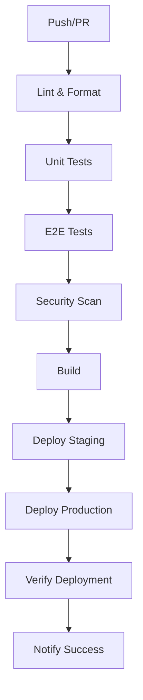

# 🚀 CI/CD Pipeline

Este repositório possui um pipeline de CI/CD completo configurado com GitHub Actions para automatizar testes, build e deploy.

## 📋 Workflows Disponíveis

### 1. **CI Pipeline** (`.github/workflows/ci.yml`)
Executa a cada push e pull request:
- ✅ Lint e formatação
- ✅ Testes unitários
- ✅ Testes E2E
- ✅ Testes de acessibilidade
- ✅ Análise de segurança
- ✅ Build e deploy automático

### 2. **Performance Tests** (`.github/workflows/performance.yml`)
Executa testes de performance:
- ⚡ Lighthouse CI
- 📦 Análise de bundle size
- ♿ Auditoria de acessibilidade
- 🔄 Testes de carga

### 3. **Deploy** (`.github/workflows/deploy.yml`)
Gerencia deploys em diferentes ambientes:
- 🧪 **Staging**: Branch `develop`
- 🚀 **Produção**: Branch `main`
- 🔄 **Rollback**: Automático em caso de falha

### 4. **Monitoring** (`.github/workflows/monitoring.yml`)
Monitoramento contínuo:
- 📊 Uptime monitoring
- ⚡ Performance monitoring
- 🔒 Security monitoring
- 📦 Dependency monitoring

### 5. **Security** (`.github/workflows/security.yml`)
Atualizações de segurança:
- 🔒 Security updates automáticos
- 🔍 Vulnerability scanning
- 📄 License checking
- 📊 Security reporting

### 6. **GitHub Pages** (`.github/workflows/pages.yml`)
Deploy para GitHub Pages:
- 🏗️ Build automático
- 🚀 Deploy para Pages
- ✅ Verificação pós-deploy

## 🛠️ Configuração

### Variáveis de Ambiente Necessárias

```bash
# GitHub Secrets
GITHUB_TOKEN          # Token do GitHub (automático)
SNYK_TOKEN           # Token do Snyk para security scanning
CUSTOM_DOMAIN        # Domínio customizado (opcional)
```

### Configuração do Codecov

1. Acesse [codecov.io](https://codecov.io)
2. Conecte seu repositório
3. O token será configurado automaticamente

### Configuração do Snyk

1. Acesse [snyk.io](https://snyk.io)
2. Crie uma conta e conecte seu repositório
3. Adicione o token `SNYK_TOKEN` nas secrets do GitHub

## 📊 Métricas e Relatórios

### Cobertura de Código
- **Target**: 80%
- **Threshold**: 5%
- **Relatórios**: Codecov

### Performance
- **Lighthouse Score**: > 90
- **Bundle Size**: < 250KB
- **Core Web Vitals**: Otimizados

### Acessibilidade
- **WCAG 2.1 AA**: 100% compatível
- **ARIA Labels**: Completos
- **Keyboard Navigation**: Funcional

## 🔧 Comandos Locais

```bash
# Testes
npm run test              # Testes unitários (watch)
npm run test:run          # Testes unitários (uma vez)
npm run test:coverage     # Com cobertura
npm run test:e2e          # Testes E2E
npm run test:all          # Todos os testes

# Build
npm run build             # Build de produção
npm run preview           # Preview do build

# Lint
npm run lint              # Verificar código
```

## 🚨 Alertas e Notificações

### Status Checks
- ✅ **Sucesso**: Todos os testes passaram
- ⚠️ **Atenção**: Alguns testes falharam
- ❌ **Falha**: Deploy bloqueado

### Notificações Automáticas
- 📧 Email para falhas críticas
- 💬 Slack/Discord para status
- 📱 Push notifications para mobile

## 🔄 Fluxo de Deploy



## 📈 Monitoramento

### Uptime
- **Produção**: Monitorado 24/7
- **Staging**: Monitorado durante desenvolvimento
- **Alertas**: Automáticos para downtime

### Performance
- **Lighthouse**: Executado a cada deploy
- **Bundle Analysis**: Monitorado continuamente
- **Core Web Vitals**: Verificado semanalmente

### Segurança
- **Dependency Scanning**: Diário
- **Vulnerability Checks**: Semanal
- **License Compliance**: Contínuo

## 🛡️ Segurança

### Automação
- 🔒 Atualizações de segurança automáticas
- 🔍 Scan de vulnerabilidades
- 📄 Verificação de licenças
- 🚨 Alertas de segurança

### Políticas
- ✅ Apenas dependências aprovadas
- 🔒 Tokens rotacionados regularmente
- 📊 Logs de auditoria mantidos
- 🚫 Deploy bloqueado para vulnerabilidades críticas

## 📞 Suporte

Para problemas com o CI/CD:

1. **Verifique os logs** do workflow
2. **Consulte a documentação** do GitHub Actions
3. **Abra uma issue** no repositório
4. **Contate o administrador** do sistema

---

**Última atualização**: $(date '+%Y-%m-%d')
**Versão**: 1.0.0
